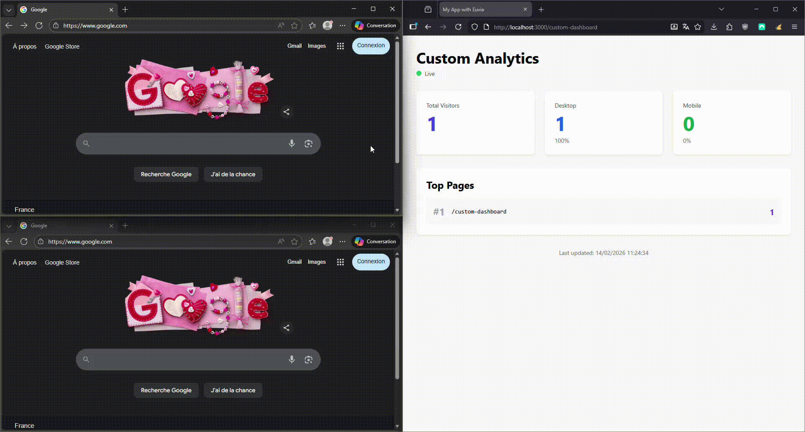

# @euvia/live

[
[
[](https://opensource.org/licenses/MIT)

Self-hosted, GDPR-compliant real-time visitor analytics for Next.js and React applications. Track live visitors with complete privacy and no consent banners required.

## Features

- **GDPR/RGPD Compliant**: 100% anonymous tracking with no personal data collection
- **Real-time Analytics**: Live visitor count, page views, and device breakdown
- **Self-hosted**: Complete data ownership and control
- **Invisible Tracking**: Zero UI footprint, no cookies, no consent banners
- **High Performance**: Optimized for 10,000+ concurrent connections
- **Easy Integration**: 2-minute setup with React components and hooks
- **Privacy First**: Hashed URLs, categorized user agents, ephemeral data (5-min TTL)

## Why Euvia?

Traditional analytics solutions require cookie consent banners and collect personal data. Euvia is designed from the ground up to be **completely anonymous** and **GDPR-compliant by design**, eliminating the need for consent popups while providing essential live visitor insights.

### Compliance Features

- **Anonymous**: Pages are base64-hashed, user agents categorized, screen sizes bucketed
- **Ephemeral**: All data stored in Redis with 5-minute TTL, no persistent logs
- **First-party**: Self-hosted WebSocket connection, no third-party services
- **No PII**: Zero personal identifiable information collected (no IP, no UUID, no cookies)

## Demo

### Live Stats Dashboard

Watch real-time visitor analytics in action:



## Examples

Two complete Next.js examples are included to get you started quickly:

### Next.js App Router Example

Modern Next.js 13+ with App Router, featuring:

- Server and Client Components
- Custom dashboard with `useEuviaStats` hook
- Built-in admin panel
- TypeScript support

**Location**: [`examples/nextjs-app-router/`](examples/nextjs-app-router/)

```bash
cd examples/nextjs-app-router
pnpm install
pnpm run dev  # Runs on http://localhost:3000
```

### Next.js Pages Router Example

Traditional Next.js setup with Pages Router:

- `_app.tsx` integration
- Admin dashboard page
- Compatible with Next.js 12+
- TypeScript support

**Location**: [`examples/nextjs-pages-router/`](examples/nextjs-pages-router/)

```bash
cd examples/nextjs-pages-router
pnpm install
pnpm run dev  # Runs on http://localhost:3002
```

Both examples include:

- ✅ Pre-configured Euvia tracker
- ✅ Admin dashboard pages
- ✅ Environment variable setup
- ✅ Tailwind CSS styling
- ✅ TypeScript configuration

See the [examples README](examples/README.md) for detailed setup instructions.

## Installation

```bash
pnpm install @euvia/live
```

### Why pnpm?

This project uses **pnpm** as the recommended package manager for several reasons:

- **Disk Efficiency**: pnpm uses a content-addressable store, saving up to 80% disk space compared to npm/yarn
- **Speed**: Faster installation times due to hard-linking instead of copying files
- **Strict Dependencies**: Better dependency resolution prevents phantom dependencies
- **Monorepo Support**: Built-in workspace support for complex projects
- **Security**: Improved security with isolated node_modules structure

You can still use npm or yarn, but pnpm is recommended for optimal performance and consistency with the development environment.

**Install pnpm:**

```bash
npm install -g pnpm
# or
curl -fsSL https://get.pnpm.io/install.sh | sh -
```

## Quick Start

### 1. Start the Server

#### Using Docker (Recommended)

```bash
# Clone the repository
git clone https://github.com/Teyk0o/euvia-nodejs
cd euvia-nodejs

# Start with Docker Compose
docker-compose up -d
```

#### Using npx

```bash
# Ensure Redis is running locally
redis-server

# Start Euvia server
npx @euvia/live server
```

#### Manual Setup

```bash
pnpm install @euvia/live

# Create .env file
cat > .env << EOF
PORT=3001
REDIS_URL=redis://localhost:6379
STATS_TTL=300
CORS_ORIGINS=http://localhost:3000
EOF

# Start server
pnpm run server
```

### 2. Add Tracking to Your Site

```tsx
// app/layout.tsx (Next.js App Router)
import { EuviaTracker } from '@euvia/live';

export default function RootLayout({ children }) {
  return (
    <html>
      <body>
        {children}
        <EuviaTracker serverUrl="ws://localhost:3001" />
      </body>
    </html>
  );
}
```

```tsx
// pages/_app.tsx (Next.js Pages Router)
import { EuviaTracker } from '@euvia/live';

export default function App({ Component, pageProps }) {
  return (
    <>
      <Component {...pageProps} />
      <EuviaTracker serverUrl="ws://localhost:3001" />
    </>
  );
}
```

### 3. View Live Stats

#### Using the Hook

```tsx
'use client'; // Next.js 13+ App Router

import { useEuviaStats } from '@euvia/live';

export default function AdminDashboard() {
  const { stats, isConnected, isLoading } = useEuviaStats({
    serverUrl: 'ws://localhost:3001',
  });

  if (isLoading) return <div>Loading stats...</div>;
  if (!stats) return <div>No data available</div>;

  return (
    <div>
      <h1>Live Visitors: {stats.totalVisitors}</h1>

      <h2>Device Breakdown</h2>
      <ul>
        <li>Desktop: {stats.deviceBreakdown.desktop}</li>
        <li>Mobile: {stats.deviceBreakdown.mobile}</li>
        <li>Tablet: {stats.deviceBreakdown.tablet}</li>
      </ul>

      <h2>Top Pages</h2>
      <ul>
        {stats.topPages.map((page) => (
          <li key={page.pageHash}>
            {page.originalPath}: {page.visitors} visitors
          </li>
        ))}
      </ul>
    </div>
  );
}
```

#### Using the Component

```tsx
import { EuviaLiveStats } from '@euvia/live';

export default function StatsPage() {
  return (
    <div>
      <h1>Analytics Dashboard</h1>
      <EuviaLiveStats serverUrl="ws://localhost:3001" maxPages={10} showPaths={true} />
    </div>
  );
}
```

## Historical Trends & Charts

Euvia provides access to historical time-series data (1h and 24h windows) through the `useEuviaCharts` hook. This flexible approach lets you build custom charts with **any charting library** you prefer.

### Using the Charts Hook

```tsx
import { EuviaChartsProvider, useEuviaCharts } from '@euvia/live';
import { LineChart, Line, XAxis, YAxis } from 'recharts'; // or any chart library

function MyCustomChart() {
  const { data, loading, error } = useEuviaCharts();

  if (loading) return <div>Loading...</div>;
  if (error) return <div>Error: {error}</div>;

  // Transform data for your chart library
  const chartData = data.totalVisitors.map((point) => ({
    time: new Date(point.timestamp).toLocaleTimeString(),
    visitors: point.value,
  }));

  return (
    <LineChart data={chartData}>
      <XAxis dataKey="time" />
      <YAxis />
      <Line dataKey="visitors" stroke="#2196f3" />
    </LineChart>
  );
}

export default function Dashboard() {
  return (
    <EuviaChartsProvider serverUrl="http://localhost:3001" timeRange="1h" autoRefresh={true}>
      <MyCustomChart />
    </EuviaChartsProvider>
  );
}
```

### Chart Library Examples

**With Recharts:**

```bash
pnpm install recharts
```

See `examples/nextjs-app-router/components/charts/` for complete Recharts examples.

**With Chart.js:**

```bash
pnpm install react-chartjs-2 chart.js
```

**With Victory:**

```bash
pnpm install victory
```

The data format is library-agnostic, so you can use any visualization library you prefer!

## API Reference

### Client Components

#### `<EuviaTracker />`

Invisible tracking component that sends visitor heartbeats.

**Props:**

| Prop                | Type                     | Default  | Description                                        |
| ------------------- | ------------------------ | -------- | -------------------------------------------------- |
| `serverUrl`         | `string`                 | required | WebSocket server URL (e.g., `ws://localhost:3001`) |
| `heartbeatInterval` | `number`                 | `60000`  | Heartbeat interval in milliseconds                 |
| `enabled`           | `boolean`                | `true`   | Enable/disable tracking                            |
| `onConnect`         | `() => void`             | -        | Callback when connected                            |
| `onDisconnect`      | `() => void`             | -        | Callback when disconnected                         |
| `onError`           | `(error: Error) => void` | -        | Callback on error                                  |

#### `<EuviaLiveStats />`

Pre-built component to display live statistics.

**Props:**

| Prop              | Type      | Default  | Description            |
| ----------------- | --------- | -------- | ---------------------- |
| `serverUrl`       | `string`  | required | WebSocket server URL   |
| `autoConnect`     | `boolean` | `true`   | Auto-connect on mount  |
| `className`       | `string`  | `''`     | Custom CSS class       |
| `showPaths`       | `boolean` | `true`   | Show unhashed paths    |
| `maxPages`        | `number`  | `10`     | Max pages to display   |
| `refreshInterval` | `number`  | `5000`   | Stats refresh interval |

### Hooks

#### `useEuviaStats(options)`

React hook for live statistics.

**Options:**

```typescript
{
  serverUrl: string;
  autoConnect?: boolean;
  onConnect?: () => void;
  onDisconnect?: () => void;
  onError?: (error: Error) => void;
}
```

**Returns:**

```typescript
{
  stats: LiveStats | null;
  isConnected: boolean;
  isLoading: boolean;
  error: Error | null;
  refresh: () => void;
  connect: () => void;
  disconnect: () => void;
}
```

#### `useEuviaCharts()`

React hook for accessing historical time-series data. Must be used within `<EuviaChartsProvider>`.

**Returns:**

```typescript
{
  data: HistoricalStats | null;     // Historical data points
  loading: boolean;                  // Loading state
  error: string | null;              // Error message if any
  timeRange: '1h' | '24h';           // Current time range
  setTimeRange: (range) => void;     // Change time range
}
```

**Data Structure:**

```typescript
interface HistoricalStats {
  totalVisitors: TimeSeriesDataPoint[];
  deviceBreakdown: {
    mobile: TimeSeriesDataPoint[];
    desktop: TimeSeriesDataPoint[];
    tablet: TimeSeriesDataPoint[];
  };
  topPages: HistoricalPageStats[];
  timeRange: '1h' | '24h';
  startTime: number;
  endTime: number;
}

interface TimeSeriesDataPoint {
  timestamp: number; // Unix timestamp in ms
  value: number; // Visitor count at that time
}

interface HistoricalPageStats {
  pageHash: string;
  originalPath?: string;
  dataPoints: TimeSeriesDataPoint[];
}
```

### Context Providers

#### `<EuviaChartsProvider />`

Context provider for historical charts data. Wrap your chart components with this provider.

**Props:**

| Prop              | Type            | Default  | Description                                     |
| ----------------- | --------------- | -------- | ----------------------------------------------- |
| `serverUrl`       | `string`        | required | HTTP server URL (e.g., `http://localhost:3001`) |
| `timeRange`       | `'1h' \| '24h'` | `'1h'`   | Time window for historical data                 |
| `autoRefresh`     | `boolean`       | `true`   | Auto-refresh data                               |
| `refreshInterval` | `number`        | `15000`  | Refresh interval in ms (default: 15 seconds)    |
| `children`        | `ReactNode`     | required | Child components                                |

**Example:**

```tsx
import { EuviaChartsProvider, useEuviaCharts } from '@euvia/live';

function App() {
  return (
    <EuviaChartsProvider serverUrl="http://localhost:3001" timeRange="1h" autoRefresh={true}>
      <MyCharts />
    </EuviaChartsProvider>
  );
}
```

### Server Configuration

#### Environment Variables

```bash
PORT=3001                          # Server port
REDIS_URL=redis://localhost:6379   # Redis connection URL
STATS_TTL=300                      # Stats TTL in seconds (default: 5 minutes)
SNAPSHOT_INTERVAL=10000            # Snapshot interval in ms (default: 10 seconds)
CORS_ORIGINS=*                     # Comma-separated allowed origins
```

#### CLI Commands

```bash
# Start server with default settings
npx @euvia/live server

# Custom configuration
npx @euvia/live server \
  --port 3001 \
  --redis redis://localhost:6379 \
  --ttl 300 \
  --cors "http://localhost:3000,https://example.com"
```

#### Programmatic Usage

```typescript
import { createEuviaServer } from '@euvia/live/server';

const server = createEuviaServer({
  port: 3001,
  redisUrl: 'redis://localhost:6379',
  statsTTL: 300,
  corsOrigins: ['http://localhost:3000'],
  broadcastInterval: 2000, // Live stats broadcast interval (ms)
  snapshotInterval: 10000, // Historical snapshot capture interval (ms)
});

await server.start();

// Graceful shutdown
process.on('SIGTERM', async () => {
  await server.stop();
});
```

## Type Definitions

```typescript
interface VisitorData {
  pageHash: string;
  deviceCategory: 'mobile' | 'desktop' | 'tablet';
  screenBucket: string;
  timestamp: number;
}

interface LiveStats {
  totalVisitors: number;
  topPages: PageStats[];
  deviceBreakdown: {
    mobile: number;
    desktop: number;
    tablet: number;
  };
  lastUpdate: number;
}

interface PageStats {
  pageHash: string;
  originalPath?: string;
  visitors: number;
}
```

## Production Deployment

### Docker Deployment

```bash
# Build and run
docker-compose up -d

# View logs
docker-compose logs -f euvia-server

# Scale if needed
docker-compose up -d --scale euvia-server=3
```

### Environment Setup

For production, create a `.env` file:

```bash
NODE_ENV=production
PORT=3001
REDIS_URL=redis://your-redis-host:6379
STATS_TTL=300
CORS_ORIGINS=https://yourdomain.com
```

### Nginx Reverse Proxy

```nginx
upstream euvia_backend {
    server localhost:3001;
}

server {
    listen 443 ssl http2;
    server_name analytics.yourdomain.com;

    location / {
        proxy_pass http://euvia_backend;
        proxy_http_version 1.1;
        proxy_set_header Upgrade $http_upgrade;
        proxy_set_header Connection "upgrade";
        proxy_set_header Host $host;
        proxy_set_header X-Real-IP $remote_addr;
        proxy_set_header X-Forwarded-For $proxy_add_x_forwarded_for;
        proxy_set_header X-Forwarded-Proto $scheme;
    }
}
```

## Performance

- **Client Bundle**: < 20KB gzipped (tree-shakable)
- **Server Capacity**: 10,000+ concurrent connections
- **Latency**: < 50ms response time
- **Memory**: ~50MB base + ~1KB per active visitor
- **Redis**: Optimized with pipelines and TTL-based cleanup

## GDPR Compliance Guide

Euvia is designed to be GDPR-compliant by default. Here's why no consent banner is required:

### Data Minimization

- **No Personal Data**: No IP addresses, user IDs, cookies, or fingerprinting
- **Anonymized**: All data is categorized and hashed before storage
- **Aggregated**: Only statistical aggregates are computed

### Legitimate Interest

Under GDPR Article 6(1)(f), legitimate interest applies when:

1. Analytics are necessary for site operation
2. Privacy impact is minimal (anonymous, ephemeral)
3. No unexpected processing occurs

Euvia meets all criteria as a first-party, anonymous analytics tool.

### Transparency

Include this in your privacy policy:

> We use self-hosted analytics (Euvia) to understand site usage. This collects anonymous data including:
>
> - Page views (hashed URLs)
> - Device categories (mobile/desktop/tablet)
> - Screen size ranges
>
> No personal information, IP addresses, or cookies are collected. Data is deleted after 5 minutes.

## Development

### Prerequisites

- **Node.js 20+** (required)
- **pnpm** (recommended) - see installation above
- **Redis 7+** (for local server)
- **Git** (for version control)

### Setup

```bash
# Clone repository
git clone https://github.com/Teyk0o/euvia-nodejs
cd euvia-nodejs

# Install dependencies (auto-installs git hooks)
pnpm install

# Start development
pnpm run dev

# Run tests
pnpm test

# Run tests with coverage
pnpm run test:coverage

# Lint code
pnpm run lint

# Format code
pnpm run format

# Type check
pnpm run typecheck

# Build
pnpm run build
```

### Git Hooks & Commit Conventions

This project uses automated quality checks and conventional commits.

#### Pre-commit Hooks

Automatically runs before each commit:

- **ESLint**: Auto-fixes TypeScript/React code issues
- **Prettier**: Formats all code files
- **Tests**: Runs tests for changed files only
- **Type Check**: Validates TypeScript types

#### Pre-push Hooks

Runs before pushing to remote:

- **Full Test Suite**: Ensures all tests pass
- **Type Check**: Complete TypeScript validation
- **Security Audit**: Checks for vulnerable dependencies

#### Commit Message Format

All commits must follow [Conventional Commits](https://www.conventionalcommits.org/):

```
<type>[optional scope]: <description>

[optional body]

[optional footer]
```

**Types:**

- `feat` - New feature
- `fix` - Bug fix
- `docs` - Documentation changes
- `style` - Code formatting (no logic change)
- `refactor` - Code refactoring
- `perf` - Performance improvements
- `test` - Adding/updating tests
- `build` - Build system or dependencies
- `ci` - CI/CD changes
- `chore` - Other changes

**Examples:**

```bash
feat(tracker): add reconnection callbacks
fix(server): resolve Redis connection leak
docs: update deployment guide
refactor(utils): simplify hash function
```

**Validation:**
Commit messages are validated automatically. Invalid formats will be rejected:

```bash
✓ feat(tracker): add new feature
✓ fix: resolve bug
✗ Add new feature  # Missing type
✗ FEAT: new feature  # Uppercase not allowed
```

**Bypass Hooks (Emergency Only):**

```bash
git commit --no-verify -m "emergency fix"
```

#### VS Code Integration

Install the **Conventional Commits** extension for easier commit message creation:

- Extension ID: `vivaxy.vscode-conventional-commits`
- Use `Ctrl+Shift+P` → "Conventional Commits"

#### Configuration Files

- `commitlint.config.js` - Commit message validation
- `.husky/` - Git hooks (pre-commit, pre-push, commit-msg)
- `.lintstagedrc.json` - Lint-staged configuration
- `.prettierrc.json` - Code formatting rules
- `.pre-commit-config.yaml` - Python pre-commit (alternative)

## Testing

```bash
# Run all tests
pnpm test

# Watch mode
pnpm run test:watch

# Coverage report
pnpm run test:coverage
```

### Testing CI Workflows Locally

Before pushing changes, it's recommended to test GitHub Actions workflows locally using [act](https://github.com/nektos/act). This helps catch CI issues early and saves time by avoiding unnecessary commits.

**Install act:**

```bash
# macOS
brew install act

# Linux
curl -s https://raw.githubusercontent.com/nektos/act/master/install.sh | sudo bash

# Windows (with chocolatey)
choco install act-cli
```

**Run workflows locally:**

```bash
# Test all workflows
act

# Test specific job
act -j test

# Test docker build
act -j docker

# Run with verbose output
act -v
```

**Note:** act requires Docker to be running. You may need to provide GitHub secrets via `.secrets` file for certain workflows.

## Architecture

```
┌─────────────────┐
│   Next.js App   │
│  (EuviaTracker) │
└────────┬────────┘
         │ WebSocket
         ▼
┌─────────────────┐
│  Euvia Server   │
│  Express + WS   │
└────────┬────────┘
         │
         ▼
┌─────────────────┐
│   Redis Cache   │
│   (5min TTL)    │
└─────────────────┘
         ▲
         │
┌────────┴────────┐
│  Admin Client   │
│ (EuviaLiveStats)│
└─────────────────┘
```

## Contributing

Contributions are welcome! Please read our [Contributing Guide](CONTRIBUTING.md) first.

```bash
# Fork and clone
git clone https://github.com/yourusername/euvia-nodejs
cd euvia-nodejs

# Create feature branch
git checkout -b feature/amazing-feature

# Make changes and test
pnpm test

# Commit and push
git commit -m "Add amazing feature"
git push origin feature/amazing-feature
```

## License

MIT License - see [LICENSE](LICENSE) file for details.

## Support

- **Issues**: [GitHub Issues](https://github.com/Teyk0o/euvia-nodejs/issues)
- **Discussions**: [GitHub Discussions](https://github.com/Teyk0o/euvia-nodejs/discussions)
- **Documentation**: [Wiki](https://github.com/Teyk0o/euvia-nodejs/wiki)

## Credits

Built with:

- [Socket.io](https://socket.io/) - Real-time WebSocket communication
- [Redis](https://redis.io/) - High-performance data storage
- [Express](https://expressjs.com/) - Web server framework
- [TypeScript](https://www.typescriptlang.org/) - Type-safe development

---

Made with privacy in mind by [Euvia Contributors](https://github.com/Teyk0o/euvia-nodejs/graphs/contributors)
